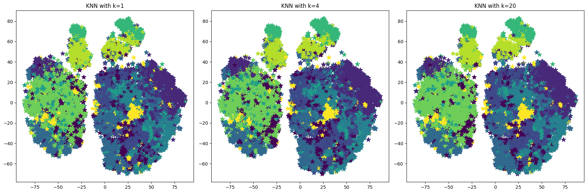

# 🎵 AI Music Recommendation System

A Content-Based Music Recommendation Web Application built with Python and Streamlit. This project uses the K-Nearest Neighbors (KNN) algorithm to recommend songs with similar audio features (like danceability, energy, and acousticness).

## ✨ Features
- **Fuzzy Search:** Don't know the exact spelling? The app uses fuzzy string matching to find the closest song in the database.
- **AI-Powered Recommendations:** Analyzes the "musical DNA" of your chosen song and uses Cosine Similarity via K-Nearest Neighbors to find 5 mathematically similar tracks.
- **Fast & Interactive UI:** Built purely in Python using Streamlit for a clean, responsive user experience.

## 🚀 How to Run Locally

1. **Clone the repository:**
   ```bash
   git clone <your-repo-url>
   cd "Music Recommendation System"
   ```

2. **Install the required libraries:**
   ```bash
   pip install -r requirements.txt
   ```

3. **Run the Streamlit app:**
   ```bash
   streamlit run app.py
   ```

## 🧠 How it Works
1. **Data Prep:** The model focuses on Bollywood/Indian genres. We extract audio features (danceability, energy, etc.) provided by the Spotify API.
2. **Training:** A `KNeighborsClassifier` is trained on these features to map the multi-dimensional space of the songs.
3. **Inference:** When a user inputs a song, the app fetches its feature array and calculates the nearest 5 neighbors in the vector space using the cosine distance metric.

## 📊 Dataset Notice
To keep this repository lightweight and fast, the original 175MB `spotify_data.csv` is **not** included. Instead, the app runs on a pre-processed, filtered dataset (`bollywood_data.csv`). 

*If you wish to run the Jupyter Notebooks or retrain the model from scratch, please download the raw Spotify dataset (from where you originally got it), name it `spotify_data.csv`, and place it in the root directory.*

## 📸 Screenshots

